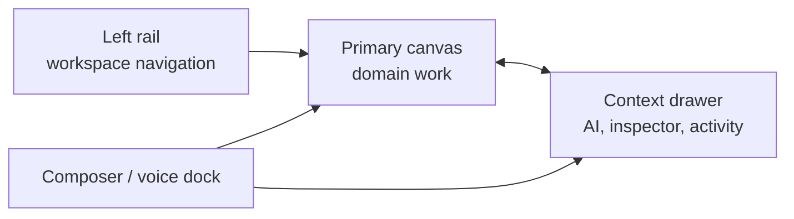
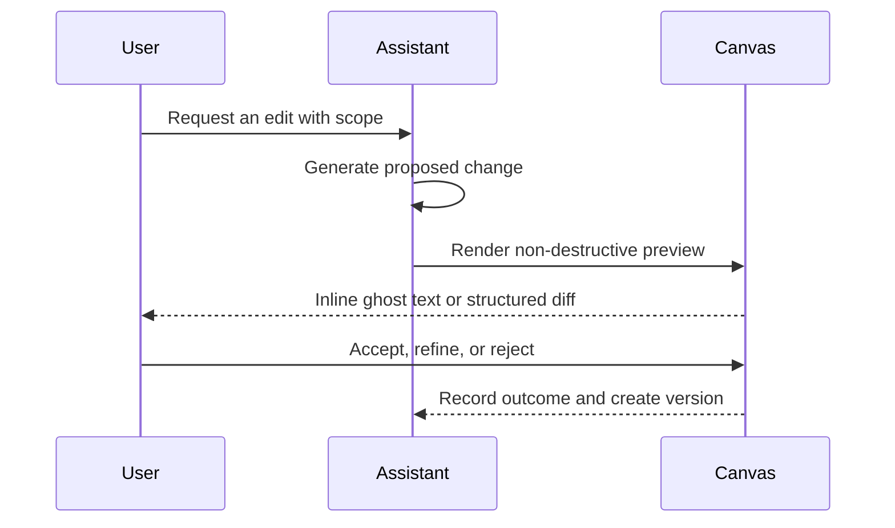
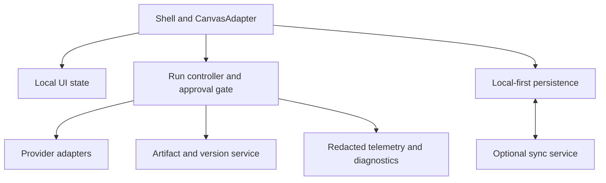

# AI-Native Workspace UX Reference

This is a product-neutral reference for designing an AI-native web or desktop
workspace. It specifies reusable interaction rules, not a visual clone or a
fixed application layout. Adapt the nouns, canvas, and data model to the
product domain while preserving the underlying user-control model.

## Design principles

1. **Work is primary; AI is an action layer.** The user's document, board,
   data view, design surface, or operational queue remains the center of the
   screen. AI helps the user inspect, create, and change that work; it does
   not replace the product with an undifferentiated chat screen.
2. **Stable spatial memory beats clever rearrangement.** Keep navigation on
   the left, domain work in the center, contextual help and inspection on the
   right, and drafting or voice controls at the bottom. Do not move these
   anchors when a run starts or an alert appears.
3. **Progressive disclosure prevents configuration fatigue.** Start with a
   useful default. Reveal provider choice, scope tuning, advanced sync,
   diagnostics, and automation controls only when a user asks for them or
   when they are needed to resolve a blocked state.
4. **Every consequential AI action is inspectable and reversible.** Show the
   target, sources, tools, status, output, and resulting diff. Use explicit
   accept/reject controls for edits and offer versions, undo, or rollback for
   state changes.
5. **Trust is a feature, not a legal footer.** State where data lives, what
   will leave the device, whether cloud sync is enabled, and which model will
   receive the request at the moment the user can act on that information.
6. **Calm is the default state.** Use motion to explain causality, color for
   status, and interruption only for a decision that blocks progress. Success
   should settle quietly; it should not demand attention.
7. **Accessibility is an interaction requirement.** Every behavior must work
   with keyboard, screen reader, touch, reduced motion, and low-bandwidth
   conditions. Never make hover, color, or drag the only way to complete work.

## Workspace shell

The shell has four independent regions. Each preserves its own state across
navigation and reloads: visibility, width, selected tab, and last useful
context.



### Left rail: navigation, not a dumping ground

Use the left rail for durable, cross-screen destinations:

- workspace switcher and account or organization context;
- primary domain objects such as projects, files, collections, records, or
  saved views;
- global search, recents, pinned items, tasks, automations, and settings;
- a compact sync/save indicator and a discreet command-palette entry point.

The rail has three modes: expanded, compact icon rail, and hidden. It should
not contain a second copy of the current canvas's tools. The active item uses
a quiet surface tint plus a thin leading indicator; never rely on a bright
fill alone. Show numeric badges only for actionable counts, and use a dot for
new activity that can wait.

On desktop, collapse or expand in 180–220 ms while the canvas reflows rather
than being covered. In compact mode, expose a tooltip after roughly 400 ms of
intentional hover or keyboard focus. On touch devices, replace the rail with a
modal navigation sheet; do not leave icon-only controls without labels.

### Primary canvas: domain-first and adapter-based

The central canvas is the application-specific surface. Treat it as a
`CanvasAdapter`, not as an editor assumption. A table, kanban board, design
canvas, analytics view, inbox, or code workspace can supply the same contract:

```ts
type CanvasAdapter = {
  selection(): SelectionSnapshot | null;
  context(): CanvasContext;
  applyPreview(change: ProposedChange): PreviewHandle;
  acceptPreview(handle: PreviewHandle): Promise<void>;
  rejectPreview(handle: PreviewHandle): void;
  createArtifact(output: AgentOutput): Artifact;
};
```

The adapter gives AI a limited, reviewable integration point. It prevents a
chat implementation from directly mutating product data without an explicit
preview or an approved operation.

### Context drawer: help where the work is

The right drawer hosts context that applies to the selected object or current
task. Recommended tabs are **Assist**, **Inspect**, **Files**, **Comments**,
**Activity**, **Versions**, and **Artifacts**. A product need not expose every
tab, but tabs should use this consistent pattern:

- **Docked** is the normal desktop mode. The user can resize it, and its width
  persists per workspace.
- **Overlay** lets a narrow screen temporarily reveal context without losing
  the canvas. It closes with Escape, its close button, or an outside click.
- **Peek** is a non-blocking, small preview of a newly available result. It
  never steals keyboard focus or collapses the canvas.
- **Fullscreen** is appropriate for a long artifact, a detailed inspector, or
  a multi-step configuration flow.

Open and close the drawer in 180–240 ms with an opacity-and-translation
transition. A double click on its resize separator resets to the default
width; keyboard users receive an equivalent “Reset panel width” command.
Persist the chosen tab and mode, but do not persist a transient error panel.

### Bottom composer and voice dock

Anchor the command surface to the bottom edge of the work area. It accepts
natural language, slash commands, attachments, and optional voice input. Keep
the current scope, model, tool permissions, and attachment state visible as
compact removable chips above or within the input.

The composer expands in place for multi-line work. Dragging files over it
reveals a clear drop zone and states which formats are accepted before upload.
During streaming, replace **Send** with **Stop**, preserve the draft, and make
the current operation visible in the activity timeline. Enter sends only when
the user has chosen that behavior; provide Ctrl/⌘+Enter as the reliable
alternative and apply the same preference in compact and expanded chat.

For voice and text-to-speech, show a small persistent transport: play/pause,
resume, stop, speed, voice, and current selection or item. TTS must continue
only with an explicit user action, provide a visible stop control, and retain
the user’s reading position when the app loses focus.

## Agent operations

AI must look and behave like accountable work, not hidden magic. An agent run
has a stable identity, a user-visible scope, a lifecycle, event history,
artifacts, and an outcome.

### Run lifecycle and status language

Use a text label and an icon in addition to color. The state model below is
intentionally small and should be shared by chat, timeline, notifications,
and accessibility announcements.

| State | Meaning | UI behavior |
| --- | --- | --- |
| Queued | Accepted but not started | Quiet queue position; user may cancel. |
| Planning | Determining approach and scope | Show planned sources/tools when ready. |
| Running | Producing output or using approved tools | Stream meaningful events; keep stop available. |
| Waiting for approval | A consequential action needs consent | Pin an actionable approval card without a modal takeover. |
| Needs input | The run cannot proceed without user information | Ask one clear question and preserve the rest of the run. |
| Completed | Work and artifacts are ready | Surface the result in place, then settle quietly. |
| Failed | Work stopped unexpectedly | Explain what failed, what was unaffected, and a safe retry. |
| Cancelled | The user stopped the run | Preserve partial output and state that it was not applied. |

Do not label a run “thinking” without meaningful progress. If detailed traces
are available, disclose them under an expandable **Run details** section with
timestamps, source references, tool calls, token or cost estimates where
available, and redacted errors. Separate model-internal reasoning from the
operational trace: show actions and evidence, not hidden chain-of-thought.

### Scope before execution

Before an agent reads sensitive or broad context, provide a compact scope
summary: selected items, included references, permitted tools, destination,
and provider. Let users edit it without abandoning their draft. Scope changes
should be explicit, such as “3 chapters selected” or “Access: selected folder
only,” rather than implicit “use all context.”

The approval card names the precise target, reason, impact, and alternatives.
It offers **Approve once**, **Approve for this task** when appropriate,
**Deny**, and **Edit request**. Never preselect approval, never place it where
the user is likely to click while aiming for a nearby control, and never use
approval history as permission for a materially different operation.

### Edit generation: preview before mutation

For an AI edit, follow this sequence:



Use ghost text only for a proposed insertion that remains distinct from user
content. It streams at a readable pace, respects reduced motion, and always
offers accept, reject, and edit-in-place. For replacement, deletion, and
structured changes, prefer a diff with clear additions, removals, and a
summary. Do not silently merge streamed output into saved content.

### Artifacts and activity

Put deliverables first: a report, image, table, patch, export, generated
record, or preview opens in an artifact dock or canvas-adjacent card. Each
artifact provides its source run, status, creation time, relevant inputs,
actions to open/copy/export/apply, and a way to return to the original work.

The activity timeline is an operational log, not a chat transcript. Group
related events, collapse routine steps, retain failures and approval decisions,
and offer **Jump to latest** after the user has scrolled away. Never yank the
scroll position during a stream. Notifications route attention in tiers:

1. Inline or drawer update for non-blocking progress.
2. Badge or toast for a completed background task.
3. Pinned approval or input request for a blocked task.
4. Modal only for destructive, irreversible, or security-critical decisions.

### Teams, automations, and remote work

Multi-agent work needs a visible parent goal with bounded child tasks. Show
each task’s role, scope, dependencies, status, latest artifact, and blocked
reason. A simple dependency graph is sufficient; avoid animating every edge.
Child agents inherit only the minimum approved context, and their outputs
return to the parent for synthesis or user review.

Schedules and automations must say whether they continue an existing task or
start an independent run, when they will next run, what scope they can access,
and how to pause or delete them. Remote execution shows the selected host,
connection state, and where output is stored. Do not imply that work is local
when it is running elsewhere.

## Interaction and motion

### Motion system

Motion explains a change of state or a spatial relationship. It is never a
reward animation, loading disguise, or prerequisite to using the product.

| Token | Duration | Typical use |
| --- | ---: | --- |
| `instant` | 80 ms | Pressed state, caret-adjacent feedback |
| `fast` | 120 ms | Tooltip, menu, chip removal |
| `standard` | 180 ms | List selection, toast, inline state |
| `panel` | 220 ms | Drawer, rail, inspector reveal |
| `complex` | 280 ms | Layout handoff, artifact expansion |

Use an ease-out curve for entrance, ease-in for exit, and ease-in-out for
position changes. Animate opacity and transform where possible; avoid costly
layout animation in long virtualized lists. Under `prefers-reduced-motion`,
remove translation and streaming cursor effects, reduce duration to near-zero,
and retain static state changes, focus placement, and status messages.

### Essential panel behaviors

- A resize handle has a visible focus state, accessible name, minimum and
  maximum bounds, pointer capture while dragging, and keyboard resizing.
- Closing a panel returns focus to its opener unless the user deliberately
  moved focus elsewhere. Opening a non-modal panel does not steal focus.
- A new artifact can trigger a gentle drawer peek; it never opens a modal or
  interrupts typing. A failed background run surfaces a badge and meaningful
  summary, not a generic red toast alone.
- Persist user-selected layout, rail mode, drawer tab, and density locally.
  Resettable preferences must be discoverable in Settings.
- Empty states explain the next useful action and show a real example. Loading
  states preserve the layout with skeletons sized like their final content.
- Long lists virtualize their contents, preserve scroll position after updates,
  and announce new results without forcing a jump.

### Keyboard, focus, and assistive technology

Publish keyboard shortcuts in a searchable help panel and permit users to
customize conflicts. Recommended defaults are Cmd/Ctrl+K for command search,
Cmd/Ctrl+Enter for reliable send, Escape to close the topmost transient layer,
and Cmd/Ctrl+Shift+P to toggle the context drawer. Avoid binding a shortcut
that conflicts with browser, operating-system, or content-editing behavior.

Use semantic landmarks for navigation, main work, complementary context, and
the composer. Announce state transitions through a polite live region, except
approvals and failures, which may use assertive announcement without repeating
large log contents. Every status color has text and an icon; every icon-only
button has an accessible name; focus rings remain visible at all times.

### Responsive rules

Desktop uses the four-region shell. Tablet retains the canvas and one docked
side region while the other becomes overlay. On mobile, navigation and context
become labeled bottom sheets, the composer remains reachable above the virtual
keyboard, and wide diffs or tables use a dedicated fullscreen review view. Do
not merely compress three desktop columns into an unreadable narrow layout.

## Optional professional editor

Use this module only when the product's primary object is rich text. It is an
optional `CanvasAdapter`, not a dependency of the workspace shell.

- Use a structured rich-text engine such as Tiptap/ProseMirror with bold,
  italic, headings, lists, links, code blocks, task lists, and extension-based
  domain features.
- Offer page-style WYSIWYG layout only for document workflows. It must be an
  explicit view choice; ordinary notes and operational content should not pay
  its complexity cost.
- Support inline remarks or comments anchored to stable document positions.
  Exports that support annotations should map them to native comments.
- Render mathematics through KaTeX or an equivalent accessible renderer, with
  source editing and readable fallback text.
- Keep typography controls purposeful: font family, size, line height, color,
  contrast-safe themes, and a focus mode. Save preferences per user, not per
  document unless the document is a template.
- Provide live word, character, paragraph, reading-time, and selection counts
  without making the status bar visually noisy.
- A current-paragraph highlight may improve focus, but must be optional. When
  the editor loses focus, retain a visible caret or insertion reference so an
  AI preview and keyboard return point are unambiguous.
- Text-to-speech works on the selected text or current section, with play,
  pause, resume, voice, and speed settings. It must not change content or
  selection without consent.

## Trust, privacy, and recovery

### Storage and sync

Default to local-first persistence: store work in browser IndexedDB for web or
an application data directory for desktop. Show save state in plain language:
**Saved locally**, **Syncing**, **Synced**, **Offline changes pending**, or
**Unable to save**. “Saved” must never mean only that a keystroke was placed in
memory.

Cloud sync is opt-in and names its account, region when relevant, conflict
behavior, and encryption model. Make a managed account sync the ordinary path
for mainstream users; put WebDAV, LAN, custom servers, and advanced identity
configuration behind an Advanced section. When there is a conflict, compare
the versions, identify the source and time, preserve both until resolution,
and avoid automatic destructive merges.

Provide automatic and manual snapshots, one-click rollback, project import and
export, and multiple product-relevant export formats. A rollback creates a new
version rather than erasing history. Exports should include a clear scope and
warn before omitting comments, attachments, or metadata.

### AI and provider trust

Use US English as the default UI locale, with clear internationalization
support rather than region-specific defaults. Offer provider-neutral choices:
OpenAI, Anthropic, Google, and custom compatible endpoints are examples, not
an ordered recommendation. Fetch model catalogs on demand, retain manually
saved models if a provider stops listing them, and show the chosen provider and
model beside an actionable request.

By default, do not use customer content to train a product model. Before a
request leaves the device, expose the selected context and destination. Store
credentials using platform secure storage where available; in a web-only
deployment, explain the difference between server-managed secrets and browser
local storage and do not imply that either is risk-free.

### Help and diagnostics

Interactive onboarding introduces one task at a time and can be dismissed or
replayed. A help panel includes searchable keyboard shortcuts, storage and sync
status, accessibility guidance, and concise recovery actions.

For startup failures, white screens, crashes, or sync issues, provide an
**Export diagnostic logs** command that produces a downloadable, reviewed JSON
bundle with no document contents, secrets, or raw credentials. Desktop clients
may also offer **Open log folder**. The diagnostic export identifies app
version, operating system, feature flags, recent error codes, and redaction
status so support can act without requesting a full user archive.

## Implementation contract

This reference is compatible with a modern TypeScript web stack. One practical
composition is React and Next.js for the application shell, Tailwind design
tokens for visual consistency, accessible primitives such as Radix or Base UI,
and a single focused state store such as Zustand for local layout state.

Use server-state caching (for example, TanStack Query) for remote data and keep
ephemeral streaming state close to the run controller. Implement AI providers
behind a narrow adapter with normalized capabilities, streaming events,
cancellation, retries, and explicit approval gates. Use SSE for one-way token
and event streams; choose WebSocket only when bidirectional real-time features
justify its operational cost.

For persistence, use IndexedDB with a typed wrapper such as Dexie or idb for
local-first web data, then add a sync service with version identifiers and
conflict records. Store attachments separately from structured records. Use
OpenTelemetry-compatible events and a privacy-reviewed error reporter for
operational observability; never log raw user work or API credentials.

Keep these boundaries explicit:



The UI consumes normalized domain events such as `run.started`,
`run.output.delta`, `approval.requested`, `artifact.ready`, `edit.previewed`,
`edit.accepted`, `sync.conflict`, and `snapshot.created`. Components must not
infer status from free-form model text.

## Acceptance checklist

Before shipping an AI-native surface, confirm the following:

- The current canvas remains usable while a run streams or a drawer is open.
- A user can see and edit scope, provider, model, and tool permissions before
  a request that sends data externally.
- Every AI edit has preview, accept, reject, and recoverable history.
- Panels are resizable, keyboard-operable, focus-safe, responsive, and retain
  sensible preferences without persisting transient failures.
- Runs expose status, cancellation, actionable errors, artifacts, and a
  compact event history without hidden reasoning claims.
- Motion is tokenized, purposeful, and reduced-motion compliant.
- Local save, sync state, conflict handling, export, snapshots, and rollback
  are understandable without documentation.
- Providers and sync methods are neutral, opt-in, and understandable to a US
  English-first audience without regional assumptions.
- Optional rich-text, TTS, mathematics, comments, and pagination modules do
  not leak into products whose canvas is not a document.
- Help, shortcut discovery, accessibility semantics, and redacted diagnostics
  work before a user needs support.

## Maintaining this reference

The `npm run docs:check` command confirms that the reference remains present
and retains its core sections. Update the document with the same pull request
whenever a shared shell behavior, run state, privacy promise, or accessibility
contract changes. Keep implementation-specific examples in code and this file
focused on durable product behavior.
